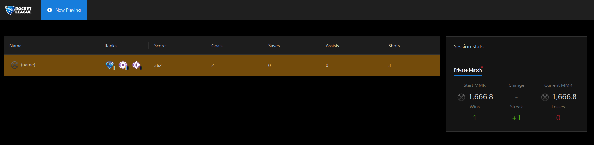

# Stats tracker for BakkesMod

## Features

* See a list of all the players in the match and their ranks
* Click on a player to open their Tracker Network page
* Keep track of your current session - wins, losses, streak, MMR change

## Building

### Plugin

Requirements

* Boost >=1.72.0 installed

Steps:

1. Open `CMakeLists.txt` in Visual Studio
2. Build All

### Server

Run `./build-server.sh`. It will write the server and frontend to the `build` folder.
Use environment variables to configure the build:

| Variable name | Description                                                                                       |
|---------------|---------------------------------------------------------------------------------------------------|
| WEBSOCKET_URL | The default URL the frontend connects to over WebSocket. Defaults to `ws://localhost:8000/ws` |

## Running the server

Use `./run.sh` or `deno run --allow-net --allow-env --allow-read server.ts`

By default, the frontend will be available at http://localhost:8000

### Configuration

Use environment variables to configure the server:

| Variable name | Description                                                                 |
|---------------|-----------------------------------------------------------------------------|
| PORT          | The port that the server will run under. Defaults to `8000`             |
| FRONTEND_ROOT | Location of the frontend (the `build` folder). Defaults to `./frontend` |

